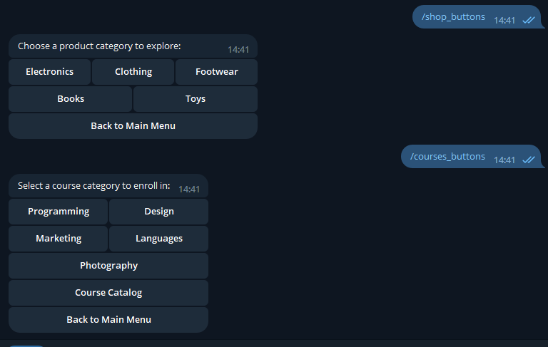
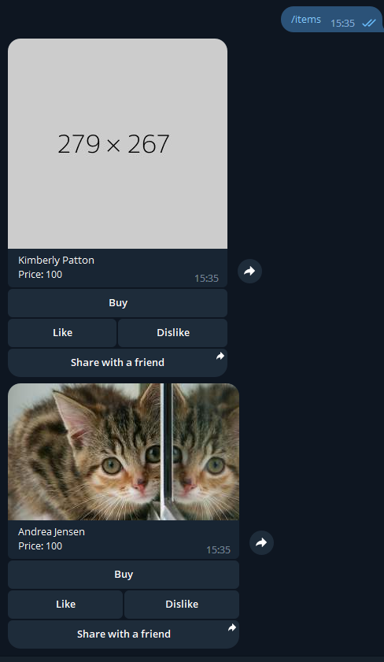
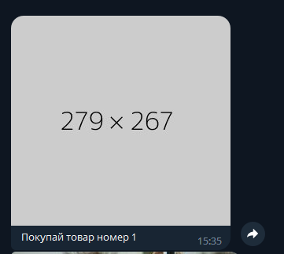
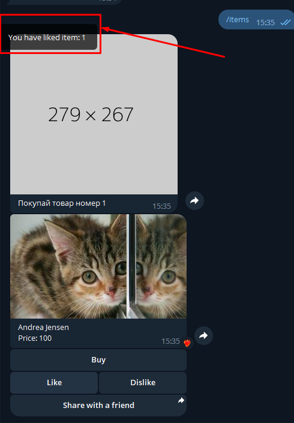
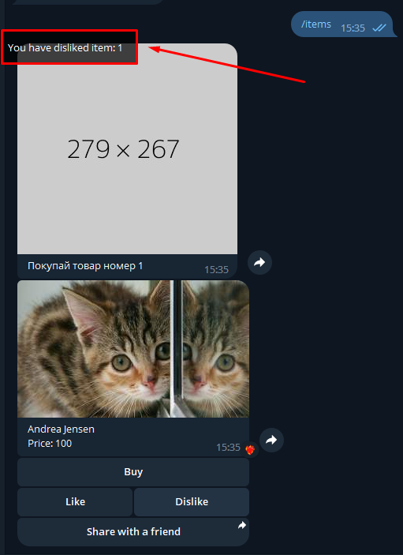

# Guide for Branch `3-inline-buttons`
Hello! In the `inline-buttons` branch, you'll build on your Telegram bot capabilities. This bot will provide users with interactive inline buttons to select different options. Depending on the theme (online shop or educational courses), users can navigate and select appropriate categories.



## Prerequisites

Before diving in, ensure you've set up the required Python packages. Use the command:

```bash
pip install -r requirements.txt
```

## Task 1

This tasks tests your ability to properly build inline markups with numbers of buttons per row.

### Steps to Implement the Inline Button Logic

1. **Initialize Router**: Initiate a router in your bot code, named `inline_buttons_router`.

2. **Define Callback Data**: 
    - Create a callback data factory **with the prefix "action"** to manage user selections.

3. **Create Online Shop Inline Keyboard**: 
    - Define a function `shop_kb()` to create an inline keyboard layout for the online shop theme. The layout should be 2 buttons per row.

4. **Create Educational Courses Inline Keyboard**:
    - Similarly, define a function `courses_kb()`, but this time for the educational courses theme. Organize the layout with 3 buttons per row.

5. **Handler Functions**: 
    - Implement handler functions (`shop_buttons_handler` and `courses_buttons_handler`) for the commands `/shop_buttons` and `/courses_buttons`, respectively. Each handler should send a message presenting its respective inline keyboard to users.

### Buttons Texts

You can use these objects to create the inline buttons:
```python
SHOP_BUTTONS = [
    'Electronics',
    'Clothing',
    'Footwear',
    'Books',
    'Toys',
    'Back to Main Menu',
]

COURSES_BUTTONS = [
    'Programming',
    'Design',
    'Marketing',
    'Languages',
    'Photography',
    'Course Catalog',
    'Back to Main Menu',
]
```


### Interacting with the Bot

Once you've implemented the bot's functionalities:

- Use `/shop_buttons` to view and interact with the online shop categories.
- Use `/courses_buttons` to explore educational course offerings.


## Task 2

This task tests your ability to properly handle user selections and send appropriate responses, with message editing.

Implement this:








## Running Tests

After you've set up the bot's inline button logic, it's crucial to test it:

```bash
pytest .\tests\inline_buttons.py --html=report.html
```

Post testing, you can view the outcomes in the `report.html` file. Additionally, the results will display in the console.

> **Note**
> - Make sure the text displayed matches the provided themes and categories. The options provided to the user should be consistent with the two proposed themes.
> - Align your bot's responses with the expected outcomes detailed in the `inline_buttons.py` test cases.

Keep up the good work and happy coding!